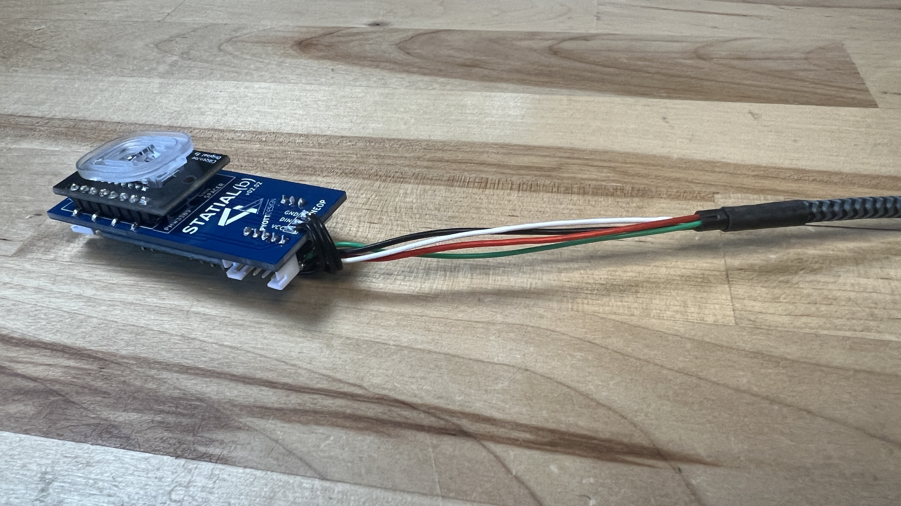

# Statial.b Adjustable Mouse
Please check [Statial.b Youtube build](youtube) and the [Instructions PDF](docs/PDF) for more info on this project.

The Statial.b is an open source DIY mouse design. The design has adjustable surfaces that can be moved and locked in position to create a wide range of ergonomics for any grip style. Files for ambidextrous builds are included.

This project requires knowledge of 3D printing, basic electronics & soldering skills as well as setting up and uploading code to an Arduino. The design is based around a 16,000 DPI optical sensor in the PMW3389 and driven by an Arduino compatible Pro Micro controller.

This is a fairly complex project. I tried to cover all the assembly details in the [Instructions PDF](docs/PDF) and on the [YouTube build](youtube), but some problem solving skills are going to be required.

The finished design is a functioning prototype, there is flex in the various surfaces and a lot of finicky adjusting to get it dialed in. It’s more fragile than a normal commercially produced product. Finally, this is a heavy mouse weighing up to a hefty 130 grams (depending on components used).

Not trying to put anyone off the build, just important to have realistic expectations about the end product. All that said, it works great and is super fun to use. There’s really nothing elese like it out there if you’re looking to explore mouse ergronimcs.

All 3D printed parts need to be made in a “tough” or “abs like” resin material:
**This project will not work if parts are 3D printed in FDM**

Current (2024) project materials costs are around $200 (not including tools). This is more of a rough guess to let you know what you are getting into.

# Code Background
* The Statial-b Arduino Sketch is modified from the [Ben Makes Everything PMW3389 Mouse](https://github.com/BenMakesEverything/PMW3389_Mouse)
* Which is based on [Dkao's Trackball Project](https://github.com/dkao/Kensington_Expert_Mouse_PMW3389_Arduino)
* That uses source code from [MrJohnk PMW3389](https://github.com/mrjohnk/PMW3389DM)

# Parts
BOM with source links can be found in the [Instructions PDF](docs/PDF).

* ~150 mL of [Tough](https://formlabs.com/store/materials/tough-2000-resin/) or [ABS Like](https://store.anycubic.com/products/abs-like-resin-pro-2?srsltid=AfmBOorbNIAT1lDaxvKePQiVIKgR78rkpZjJtzsf-5b1XAJdDYxI4YjZ) resin
* [PMW3389 Optical Sensor](https://www.tindie.com/products/citizenjoe/pmw3389-motion-sensor/)
* Pro Micro (5 volt)
* [Custom Bridge Board](docs/PDF)
* Misc M2 and M2.5 button head screws
* M2 and M2.5 nuts
* 2.0mm pitch PH type end connectors & right angle through hole board connectors
* (5) Mouse switches
* 1/8" diameter aluminum tube stock
* 2.54mm headers, surface mount gull wing, cut to length
* Push button momentary switch, 6mm x 6mm x 4.5mm
* [TTC Rotary Encoder](https://www.amazon.com/dp/B0CF9FS3QS?_encoding=UTF8&psc=1&ref=cm_sw_r_cp_ud_dp_CJSM6787T27A3HG0CDGT&ref_=cm_sw_r_cp_ud_dp_CJSM6787T27A3HG0CDGT&social_share=cm_sw_r_cp_ud_dp_CJSM6787T27A3HG0CDGT&skipTwisterOG=1)
* [NeoPixel 5050 RGB LED](https://www.adafruit.com/product/1655)
* Mouse Glides for Logitech G-Pro
* 28 Ga. 6 conductor silicone ribbon wire (or similar)
* Soldering Iron, Multi-meter, PH Crimping tool and other misc. tools

# Instructions
For complete instructions, please download the [Instrucitons PDF here](docs/PDF).

