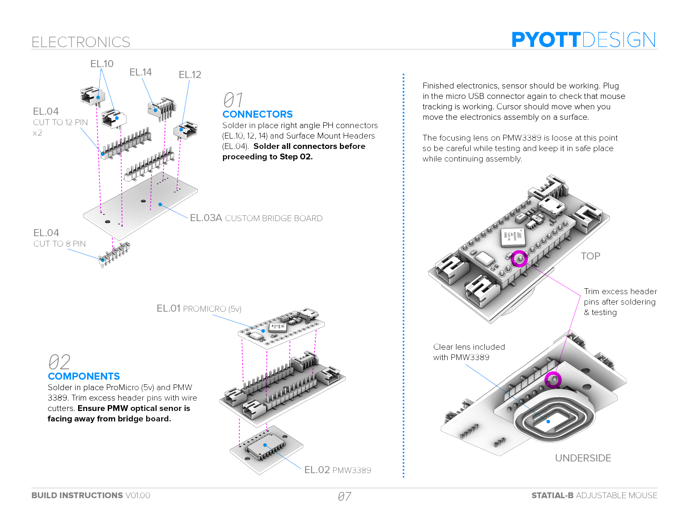
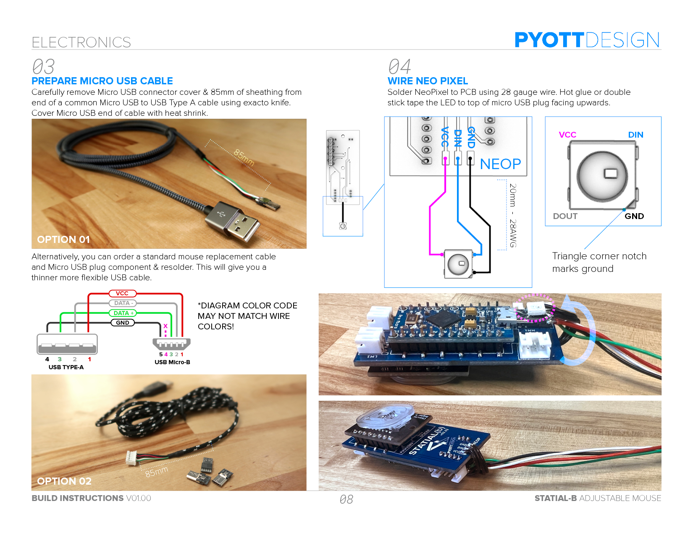
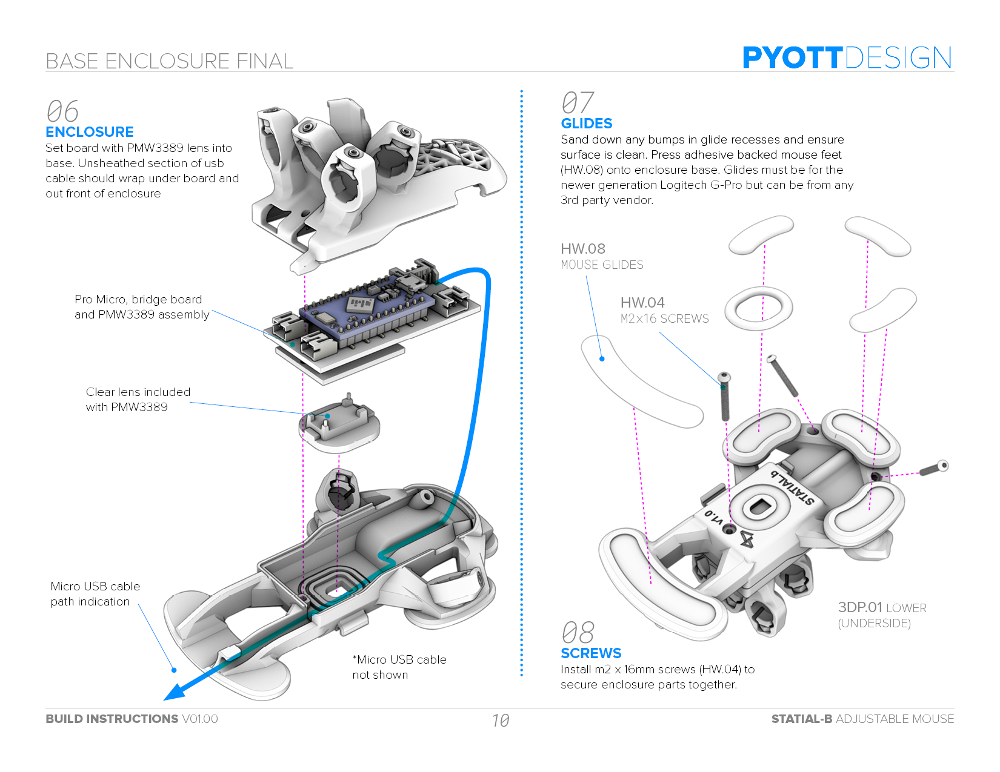
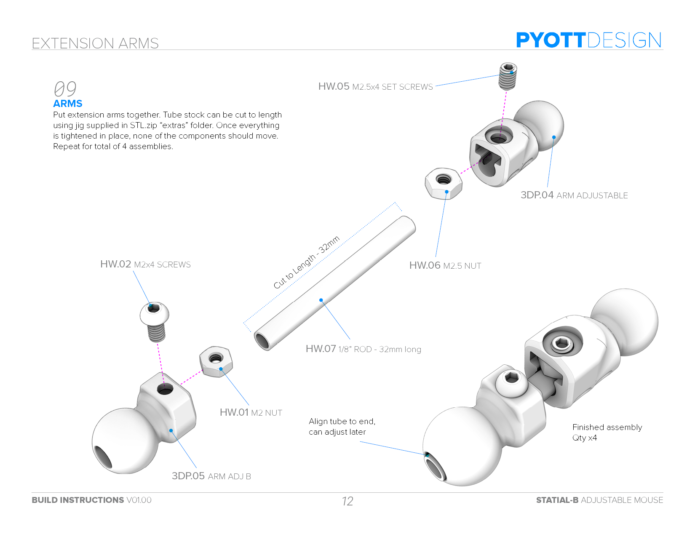
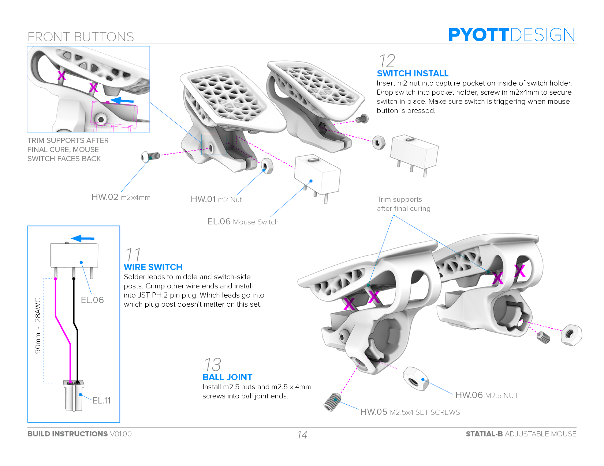
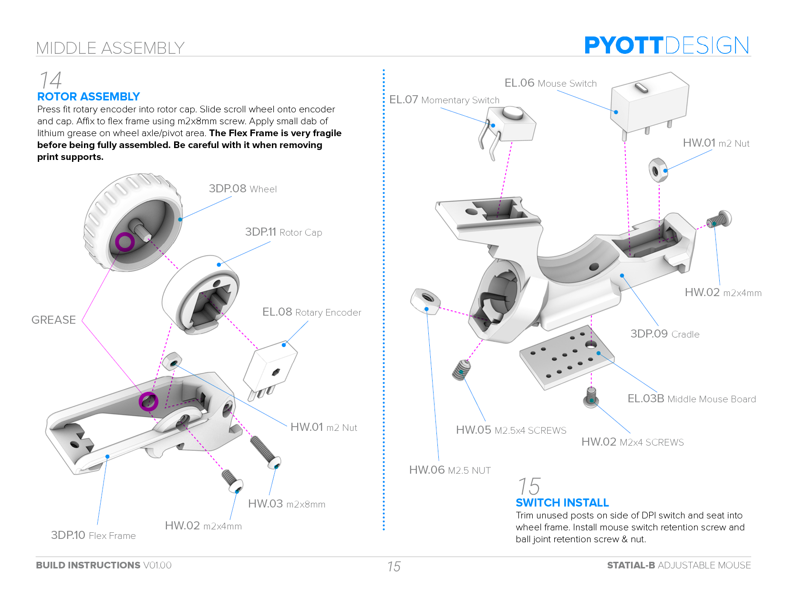
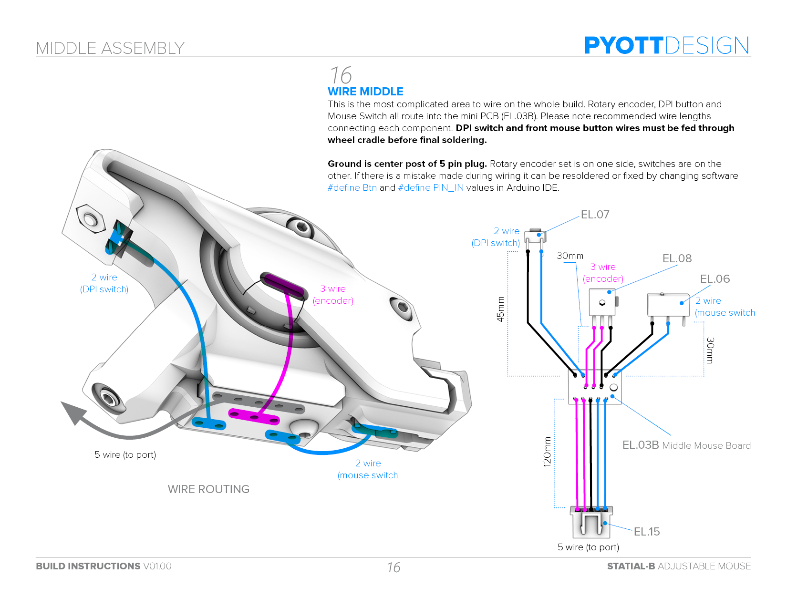
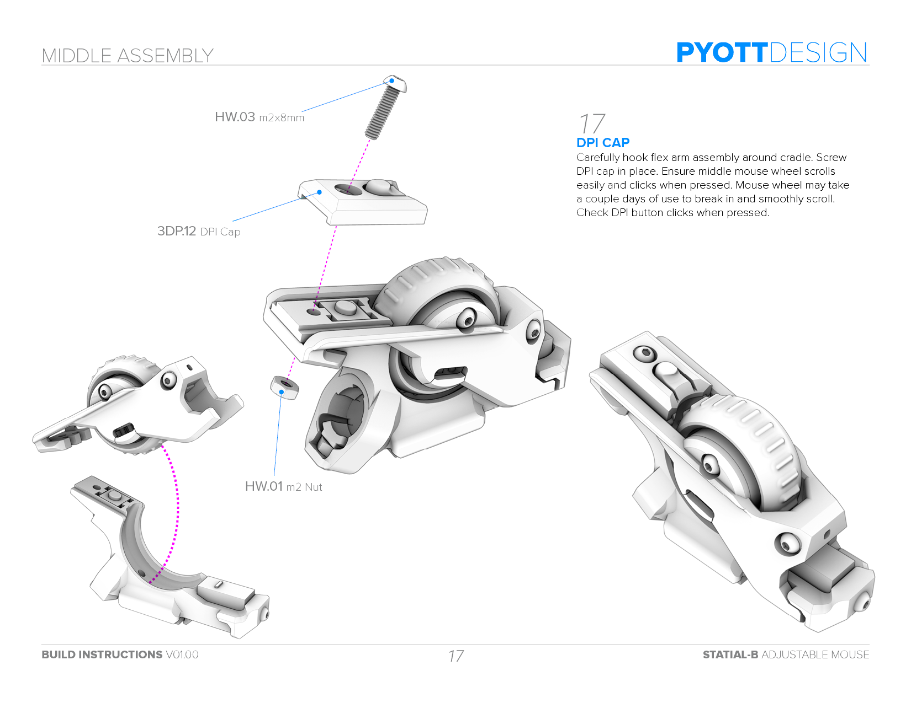
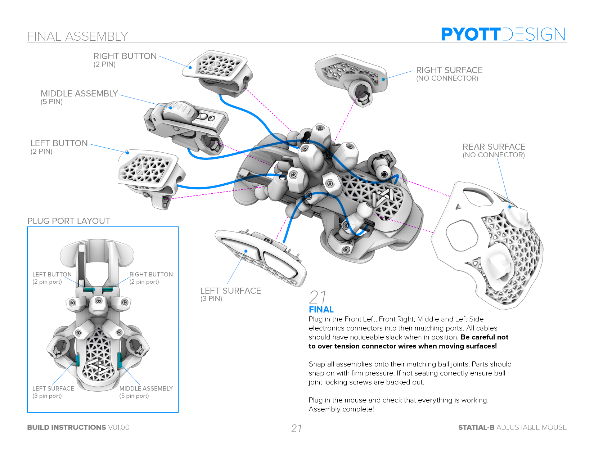

# Statial.b Adjustable Mouse
Please check [Statial.b Youtube build](youtube) and the [Statial.b Instructions PDF](statial-b_instructions_v01-00.pdf) for more info on this project.

The Statial.b is an open source DIY mouse design. This concept has adjustable surfaces that can be moved and locked in position to create a wide range of ergonomics for any grip style. Files for ambidextrous builds are included.

Knowledge of 3D printing, basic electronics & soldering skills as well as the ability to upload code to an Arduino are needed for this build. The design is based around a 16,000 DPI optical sensor in the PMW3389 and driven by an Arduino compatible Pro Micro controller.

This is a fairly complex project. I tried to cover all the assembly details in the in the instructions PDF and on YouTube, but some problem solving skills are still going to be required.

The finished design is a functioning prototype that requires a lot of adjusting to get it dialed in and is more fragile than a normal commercially produced product. It’s also a heavy mouse weighing up to a hefty 130 grams (depending on components used). All that said, it works great and is super fun to use. There’s really nothing else like it out there if you’re looking to explore mouse ergonomics.

All 3D printed parts need to be made in a “Tough” or “ABS like” resin material. Resin print color is up to you. **This project requires resin printed parts. 
It will not work if parts are 3D printed with the FDM process.**

Current (2024) project materials costs are around $200 (not including tools). This is a rough guess so you have an idea of what you’re getting into.

# Code Background
* The Statial-b Arduino Sketch is modified from the [Ben Makes Everything PMW3389 Mouse](https://github.com/BenMakesEverything/PMW3389_Mouse)
* Which is based on [Dkao's Trackball Project](https://github.com/dkao/Kensington_Expert_Mouse_PMW3389_Arduino)
* That uses source code from [MrJohnk PMW3389](https://github.com/mrjohnk/PMW3389DM)

# Parts
Full BOM with source links can be found in the [Statial.b Instructions PDF](statial-b_instructions_v01-00.pdf).

* ~150 mL of [Tough](https://formlabs.com/store/materials/tough-2000-resin/) or [ABS Like](https://store.anycubic.com/products/abs-like-resin-pro-2?srsltid=AfmBOorbNIAT1lDaxvKePQiVIKgR78rkpZjJtzsf-5b1XAJdDYxI4YjZ) resin
* [PMW3389 Optical Sensor](https://www.tindie.com/products/citizenjoe/pmw3389-motion-sensor/)
* Pro Micro (5 volt)
* [Custom Bridge Board](docs/PDF)
* Misc M2 and M2.5 button head screws
* M2 and M2.5 nuts
* 2.0mm pitch PH type end connectors & right angle through hole board connectors
* (5) Mouse switches
* 1/8" diameter aluminum tube stock
* 2.54mm headers, surface mount gull wing, cut to length
* Push button momentary switch, 6mm x 6mm x 4.5mm
* [TTC Rotary Encoder](https://www.amazon.com/dp/B0CF9FS3QS?_encoding=UTF8&psc=1&ref=cm_sw_r_cp_ud_dp_CJSM6787T27A3HG0CDGT&ref_=cm_sw_r_cp_ud_dp_CJSM6787T27A3HG0CDGT&social_share=cm_sw_r_cp_ud_dp_CJSM6787T27A3HG0CDGT&skipTwisterOG=1)
* [NeoPixel 5050 RGB LED](https://www.adafruit.com/product/1655)
* Mouse Glides for Logitech G-Pro
* 28 Ga. 6 conductor silicone ribbon wire (or similar)
* Soldering Iron, Multi-meter, PH Crimping tool and other misc. tools

# Instructions
For complete instructions, please download the [Statial.b Instructions PDF](statial-b_instructions_v01-00.pdf).

